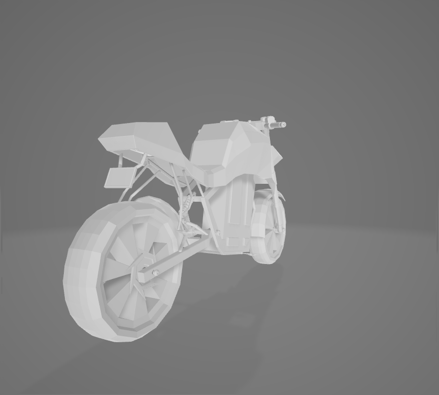

# Bike
 Simple project to showcase a 3d bike in blender. (2020)

 Here I make a 3D bike after seen a youtube (watch [@James Biggar ](https://youtu.be/gYs_jYUyaoY?t=1591)) video in 2020. 

 ## Project description
Name: Bike-3D 
Software: Blender 
platform: 3D  
Project No: Update me  
Year: 2020

## Render Video

## Sample from youtube
*watch [@James Biggar ](https://youtu.be/gYs_jYUyaoY?t=1591)  
  

## Render Img
  
   
   
   
   

## 3D file
* **[bike](3d/bike.fbx)**

## Authors

* **AbirHasan**

Check out my other works [@XAbirHasan](https://github.com/XAbirHasan)

